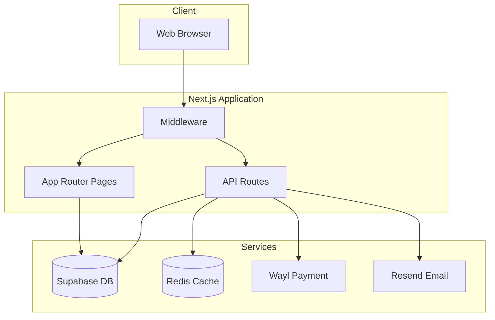
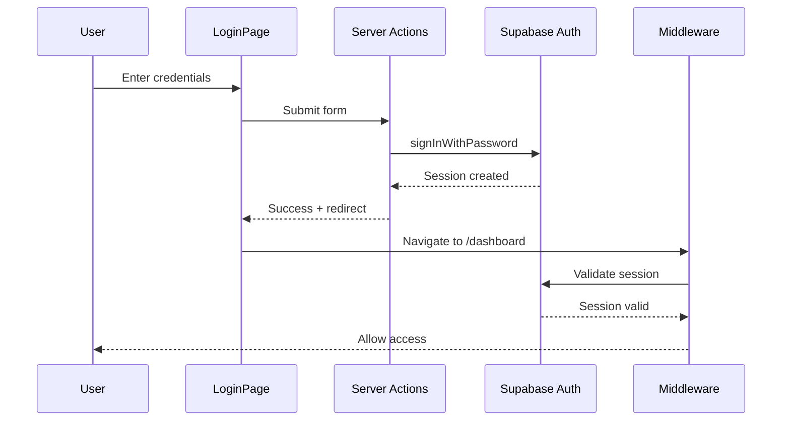
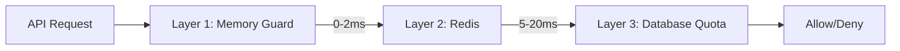
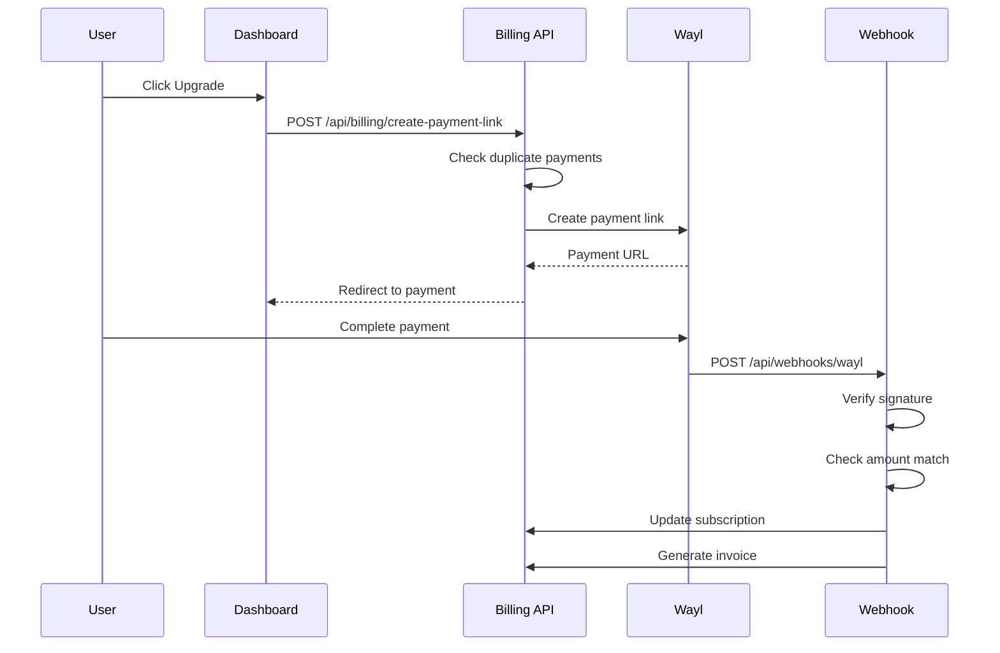
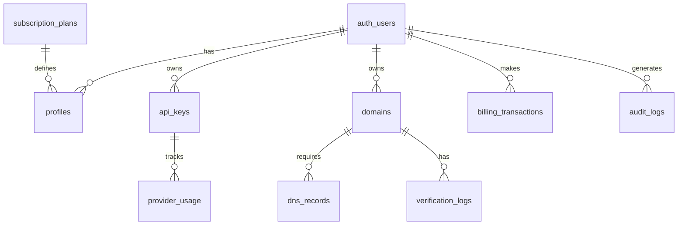
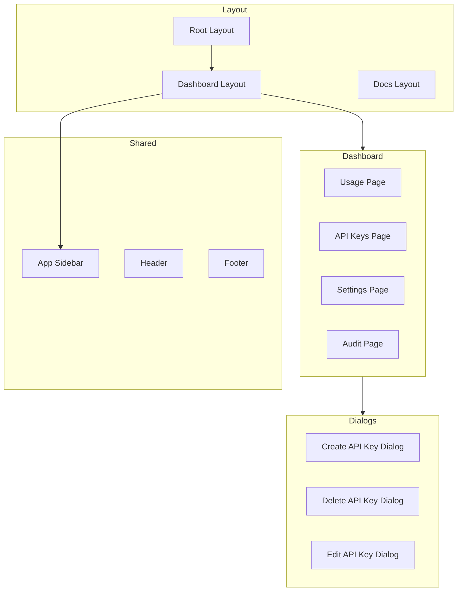
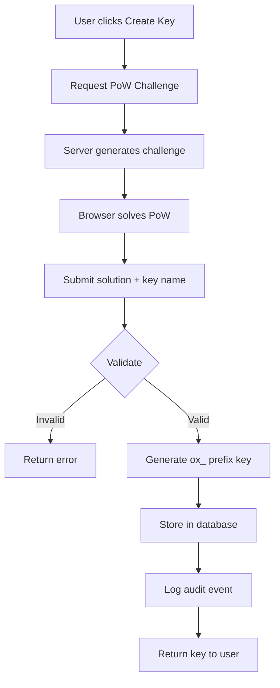
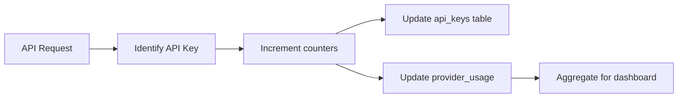

# ObitoX Codebase Architecture Analysis

## Executive Summary

ObitoX is an **Enterprise-grade API Management Platform** built with Next.js 16, designed to provide secure API key management, multi-layer rate limiting, subscription billing, and comprehensive usage analytics. The platform integrates with Supabase for authentication and database services, Redis for distributed rate limiting, and Wayl for payment processing.

---

## 1. Technology Stack

### Core Framework
- **Next.js 16.1.6** - App Router architecture with React 19
- **TypeScript 5** - Type-safe development
- **Tailwind CSS 4** - Utility-first styling

### Key Dependencies
| Category | Technology | Purpose |
|----------|------------|---------|
| Authentication | Supabase Auth | User management, OAuth, session handling |
| Database | Supabase (PostgreSQL) | Primary data store with RLS policies |
| Rate Limiting | Upstash Rate Limit, ioredis | Multi-layer request throttling |
| Payments | Wayl API | Payment gateway for IQD currency |
| Email | Resend | Transactional emails (OTP, notifications) |
| UI Components | Radix UI, shadcn/ui | Accessible component primitives |
| Charts | Recharts | Usage analytics visualization |
| PDF Generation | @react-pdf/renderer | Invoice generation |

---

## 2. Application Architecture

### High-Level System Flow



### Directory Structure

```
src/
|-- app/                    # Next.js App Router
|   |-- (auth)/            # Auth route group (login, signup, OTP)
|   |-- api/               # API route handlers
|   |-- dashboard/         # Protected dashboard pages
|   |-- docs/              # Documentation pages
|   |-- billing/           # Payment flow pages
|   |-- auth/callback/     # OAuth callback handler
|
|-- components/            # React components
|   |-- ui/               # Base UI primitives (shadcn)
|   |-- docs/             # Documentation-specific components
|   |-- layout/           # Layout components
|
|-- lib/                   # Core business logic
|   |-- supabase/         # Supabase client configuration
|   |-- rate-limiting/    # Multi-layer rate limiting
|   |-- invoices/         # PDF invoice generation
|   |-- domains/          # Domain verification (deprecated)
|
|-- contexts/             # React contexts
|   |-- subscription-context.tsx
|   |-- appearance-context.tsx
|
|-- hooks/                # Custom React hooks
|-- config/               # Application configuration
```

---

## 3. Authentication System

### Authentication Flow



### Auth Features
- **Email/Password Authentication** - Traditional signup with OTP verification
- **Google OAuth** - One-click social authentication
- **OTP Verification** - 6-digit code sent via Resend email
- **Session Management** - Cookie-based sessions via Supabase SSR

### Route Protection
The middleware in [`src/middleware.ts`](src/middleware.ts) enforces:
- Dashboard routes require authentication
- Auth routes redirect authenticated users to dashboard
- Maintenance mode for specific paths (e.g., `/dashboard/settings/team`)

---

## 4. API Routes Structure

### API Endpoints Overview

| Route | Method | Purpose |
|-------|--------|---------|
| `/api/apikeys` | GET, POST | List/create API keys |
| `/api/apikeys/[id]` | DELETE, PATCH | Delete/rename API keys |
| `/api/apikeys/limit` | GET | Get API key limit for user tier |
| `/api/subscription` | GET | Get subscription details |
| `/api/usage` | GET | Get usage statistics |
| `/api/usage/history` | GET | Historical usage data |
| `/api/billing/create-payment-link` | POST | Create Wayl payment link |
| `/api/billing/verify` | POST | Verify payment status |
| `/api/webhooks/wayl` | POST | Handle Wayl payment webhooks |
| `/api/audit-logs` | GET | Fetch audit logs |
| `/api/pow/challenge` | GET | Proof-of-work challenge |
| `/api/search` | GET | Search functionality |

### Security Features
- **Security Headers** - CSP, X-Frame-Options, X-Content-Type-Options
- **Input Sanitization** - XSS prevention in API key names
- **Rate Limiting** - Per-IP and per-user throttling
- **Proof-of-Work** - Anti-bot protection for API key creation

---

## 5. Rate Limiting System

### Multi-Layer Architecture



### Layer Details

| Layer | Response Time | Purpose | Storage |
|-------|---------------|---------|---------|
| Memory Guard | 0-2ms | Prevent server overload | In-memory Map |
| Redis | 5-20ms | Distributed hourly limits | Redis cache |
| Database | 50-100ms | Total quota enforcement | PostgreSQL |

### Tier-Based Limits

```typescript
// From src/lib/rate-limiting/config.ts
HOURLY: {
  free: { 'domain-create': 3, 'domain-verify': 30 },
  pro: { 'domain-create': 20, 'domain-verify': 100 },
  enterprise: { 'domain-create': 100, 'domain-verify': -1 } // unlimited
}
```

---

## 6. Billing & Payment System

### Payment Flow



### Security Measures
1. **Replay Protection** - 5-minute timestamp validation
2. **Amount Verification** - Server-side amount matching
3. **Idempotency** - `webhook_received_at` check prevents double processing
4. **Signature Verification** - HMAC-based webhook authentication
5. **Duplicate Prevention** - 15-minute window for pending payments

### Currency Handling
- Prices stored in **cents** (2400 = $24.00)
- Converted to **IQD** (Iraqi Dinar) at runtime
- Exchange rate configurable via `USD_TO_IQD_RATE` env var

---

## 7. Database Schema

### Core Tables



### Key Tables

| Table | Purpose |
|-------|---------|
| `profiles` | User profile with subscription tier |
| `profiles_with_tier` | Computed view for tier with expiration logic |
| `api_keys` | API key storage with usage stats |
| `provider_usage` | Per-provider usage tracking |
| `billing_transactions` | Payment transaction records |
| `subscription_plans` | Plan definitions and pricing |
| `audit_logs` | User action audit trail |
| `domains` | Domain management (deprecated) |
| `dns_records` | DNS verification records |
| `domain_abuse_events` | Security monitoring |

---

## 8. Subscription Tiers

### Tier Comparison

| Feature | Free | Pro | Enterprise |
|---------|------|-----|------------|
| API Keys | 1 | 15 | Unlimited |
| Requests/month | 5,000 | 100,000 | Unlimited |
| Domains | 3 | 50 | 1,000 |
| Batch Operations | No | Yes | Yes |
| Advanced Analytics | No | Yes | Yes |
| Priority Support | No | No | Yes |

### Tier Determination
- Uses `profiles_with_tier` database view
- Computes `is_subscription_expired` dynamically
- Grace period handling for expired subscriptions

---

## 9. Component Architecture

### UI Component Hierarchy



### Key Components
- **AppSidebar** - Navigation with user profile, plan badge
- **CreateApiKeyDialog** - PoW-protected key creation flow
- **UsageOverview** - Charts and statistics display
- **PlanBadge** - Visual tier indicator
- **DateRangePicker** - Analytics date filtering

---

## 10. State Management

### React Contexts

| Context | Purpose |
|---------|---------|
| `SubscriptionContext` | Global subscription state, auto-refresh |
| `AppearanceContext` | Theme and UI preferences |

### Data Flow Pattern
1. Context provides initial state
2. Components consume via custom hooks (`useSubscription`)
3. Server actions mutate data
4. Context refetches on demand

---

## 11. Security Features

### Implemented Protections

| Feature | Implementation |
|---------|----------------|
| CSRF | SameSite cookies via Supabase |
| XSS | Input sanitization, CSP headers |
| Rate Limiting | Multi-layer (memory + Redis) |
| Auth Protection | Middleware route guards |
| API Security | Key prefix validation, PoW challenges |
| Webhook Security | Signature verification, replay protection |
| SQL Injection | Parameterized queries via Supabase |

### Proof-of-Work System
- Browser-based SHA-256 challenge solving
- Prevents mass API key creation
- ~500ms solve time for difficulty 4
- Non-blocking UI with batched processing

---

## 12. External Integrations

### Supabase Integration
- **Auth** - Email/password, Google OAuth
- **Database** - PostgreSQL with RLS policies
- **Realtime** - Not currently used

### Wayl Payment Gateway
- Iraqi Dinar (IQD) payment processing
- Webhook-based payment confirmation
- Payment link generation

### Resend Email Service
- OTP verification emails
- Transactional notifications

### Redis (ioredis)
- Distributed rate limiting
- Session caching potential

---

## 13. Environment Variables

### Required Configuration

```bash
# Supabase
NEXT_PUBLIC_SUPABASE_URL=
NEXT_PUBLIC_SUPABASE_ANON_KEY=
SUPABASE_SERVICE_ROLE_KEY=

# Payment Gateway
WAYL_API_KEY=
WAYL_API_URL=
WAYL_WEBHOOK_SECRET=
USD_TO_IQD_RATE=

# Email
RESEND_API_KEY=

# Redis (optional)
REDIS_URL=
```

---

## 14. Key Data Flows

### API Key Creation Flow



### Usage Tracking Flow



---

## 15. Deprecation Notes

### Domain Management Feature
- Domain verification functionality has been **deprecated**
- DNS verification cron job removed from instrumentation
- Related code remains in codebase but is not actively used
- Tables still exist: `domains`, `dns_records`, `domain_abuse_events`

---

## 16. Development Scripts

### Available Scripts
- `npm run dev` - Development server
- `npm run build` - Production build
- `npm run start` - Production server
- `npm run lint` - ESLint check

### Test Scripts (in `/scripts`)
- `test-redis-connection.ts` - Redis connectivity test
- `test-rate-limiting.ts` - Rate limiter validation
- `test-database-schema.ts` - Schema verification
- `test-domain-ownership.ts` - Domain ownership checks

---

## Summary

ObitoX is a well-architected API management platform with:

1. **Robust Authentication** - Multi-method auth with Supabase
2. **Enterprise Security** - Multi-layer rate limiting, PoW anti-bot
3. **Flexible Billing** - Wayl integration for IQD payments
4. **Comprehensive Analytics** - Usage tracking and visualization
5. **Audit Compliance** - Full action logging
6. **Scalable Architecture** - Redis caching, tiered rate limits

The codebase follows Next.js best practices with clear separation of concerns between API routes, server actions, and client components.