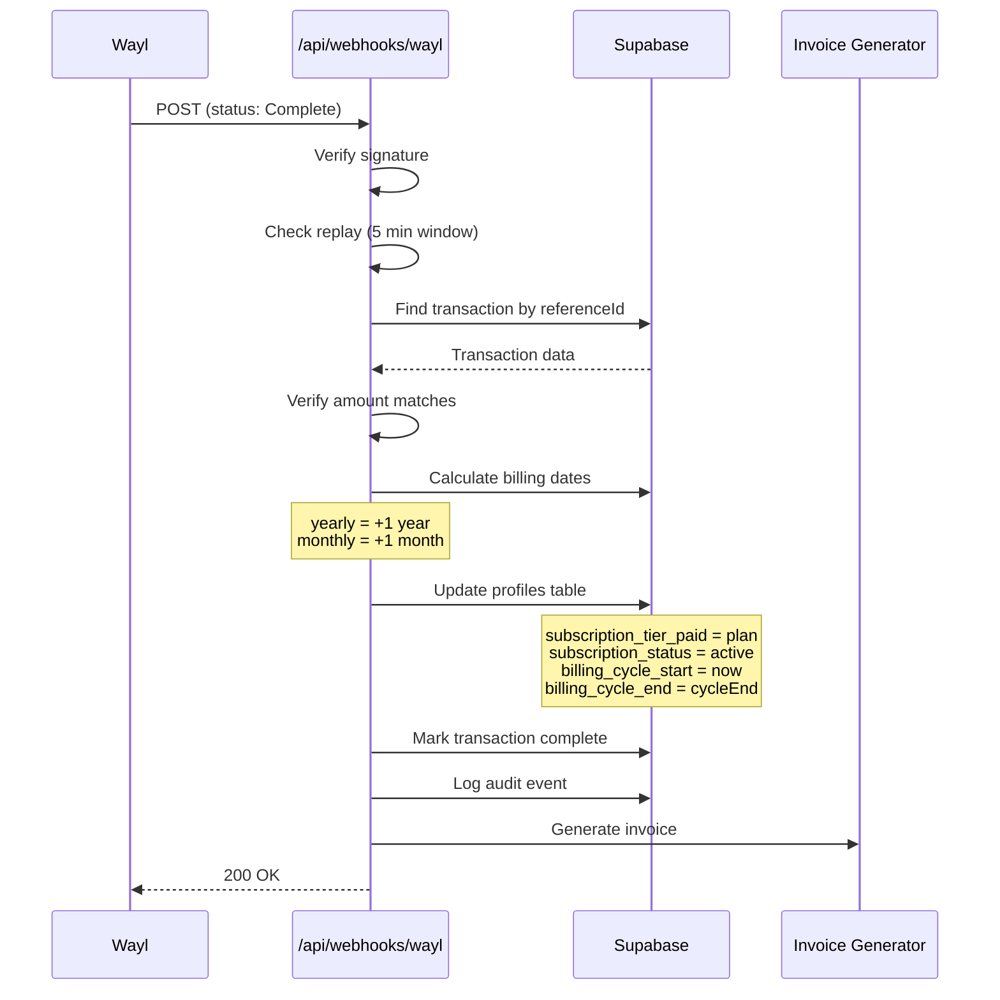
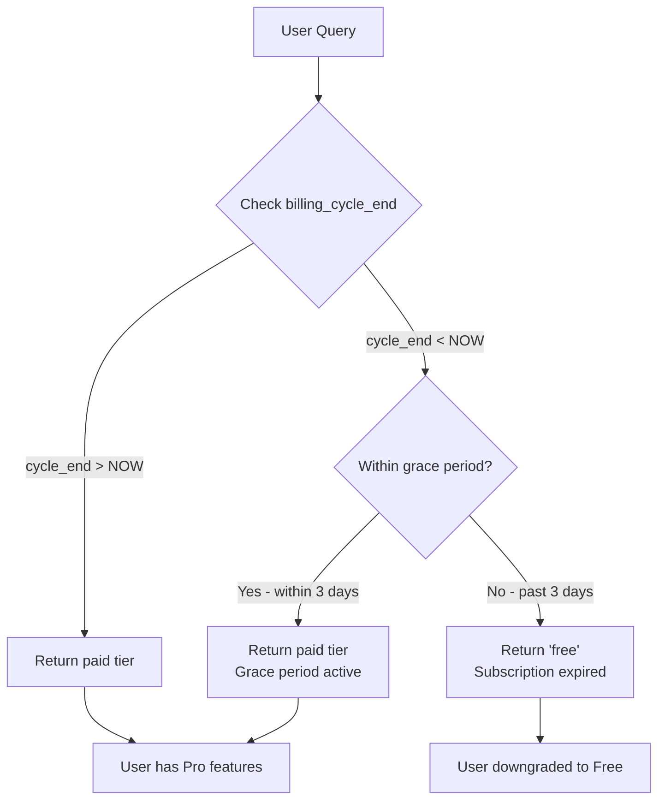

# Post-Payment Flow & Subscription Expiration Analysis

## Overview

This document analyzes the complete flow after a user confirms payment, including how yearly subscriptions work and how expiration is handled.

---

## 1. Payment Confirmation Flow

### Webhook Handler
**File:** [`src/app/api/webhooks/wayl/route.ts`](src/app/api/webhooks/wayl/route.ts)

When Wayl confirms payment, the webhook handler:



### Key Code (Lines 126-146)

```typescript
// Calculate billing dates
const now = new Date();
const cycleEnd = new Date(now);
if (transaction.billing_cycle === 'yearly') {
    cycleEnd.setFullYear(cycleEnd.getFullYear() + 1);  // +1 YEAR
} else {
    cycleEnd.setMonth(cycleEnd.getMonth() + 1);        // +1 MONTH
}

// Update user account
const { error: updateError } = await supabase
    .from('profiles')
    .update({
        subscription_tier_paid: plan.tier,  // What they PAID for
        subscription_status: 'active',
        billing_cycle_start: now.toISOString(),
        billing_cycle_end: cycleEnd.toISOString()
    })
    .eq('id', transaction.user_id);
```

---

## 2. Yearly Subscription Handling

### How It Works

| Billing Cycle | `billing_cycle_start` | `billing_cycle_end` |
|---------------|----------------------|---------------------|
| Monthly | Today | Today + 1 month |
| Yearly | Today | Today + 1 year |

### Example

If a user pays for Pro Yearly on **2026-02-14**:
- `billing_cycle_start`: 2026-02-14
- `billing_cycle_end`: **2027-02-14** (1 year later)

The subscription remains active until `billing_cycle_end` passes.

---

## 3. Subscription Expiration Mechanism

### The Solution: Database View with Runtime Check

The system uses a **computed view** (`profiles_with_tier`) that calculates the effective tier in real-time.

### Database View Definition

**File:** [`billing_database_architecture.md`](billing_database_architecture.md)

```sql
CREATE OR REPLACE FUNCTION get_effective_subscription_tier(
    p_tier_paid VARCHAR,
    p_status VARCHAR,
    p_cycle_end TIMESTAMPTZ,
    p_grace_period_days INTEGER DEFAULT 3
)
RETURNS VARCHAR AS $$
BEGIN
    -- If cancelled, immediately downgrade
    IF p_status = 'cancelled' THEN
        RETURN 'free';
    END IF;
    
    -- If expired and past grace period, downgrade
    IF p_cycle_end IS NOT NULL AND p_cycle_end < NOW() THEN
        IF p_cycle_end < NOW() - INTERVAL '1 day' * p_grace_period_days THEN
            RETURN 'free';  -- Grace period expired
        ELSE
            RETURN p_tier_paid;  -- Still in grace period
        END IF;
    END IF;
    
    -- Active subscription
    RETURN COALESCE(p_tier_paid, 'free');
END;
$$ LANGUAGE plpgsql IMMUTABLE;

CREATE OR REPLACE VIEW profiles_with_tier AS
SELECT 
    p.*,
    get_effective_subscription_tier(
        p.subscription_tier_paid,
        p.subscription_status,
        p.billing_cycle_end,
        3  -- 3 day grace period
    ) AS subscription_tier,
    
    -- Is subscription expired?
    CASE 
        WHEN p.billing_cycle_end IS NOT NULL AND p.billing_cycle_end < NOW() 
        THEN TRUE 
        ELSE FALSE 
    END AS is_subscription_expired,
    
    -- Days until expiration (negative if expired)
    CASE 
        WHEN p.billing_cycle_end IS NOT NULL 
        THEN EXTRACT(DAY FROM (p.billing_cycle_end - NOW()))::INTEGER
        ELSE NULL
    END AS days_until_expiration
    
FROM profiles p;
```

### How Expiration Works



### Grace Period

| Status | Condition | Effective Tier |
|--------|-----------|----------------|
| Active | `billing_cycle_end > NOW()` | Paid tier (pro/enterprise) |
| Expired (Grace) | `NOW() > billing_cycle_end` AND within 3 days | Paid tier (grace period) |
| Expired | `NOW() > billing_cycle_end + 3 days` | **free** |

---

## 4. No Cron Job Needed!

### Why It Works Without Cron

The `profiles_with_tier` view computes the tier **on every read**:

```typescript
// Every API route uses this view
const { data: profile } = await supabase
    .from('profiles_with_tier')  // View, not table!
    .select('*')
    .eq('id', user.id)
    .single();

// profile.subscription_tier is ALWAYS accurate
// If expired, it automatically returns 'free'
```

### Benefits

| Feature | Status |
|---------|--------|
| Real-time accuracy | Works on every read |
| No cron jobs | Database does the work |
| Grace period | 3 days to renew |
| Zero maintenance | Set and forget |
| Supabase friendly | Works with RLS |

---

## 5. Code Integration Points

### Files Using `profiles_with_tier` View

| File | Usage |
|------|-------|
| [`src/app/api/subscription/route.ts`](src/app/api/subscription/route.ts:76) | Get subscription data |
| [`src/lib/subscription.ts`](src/lib/subscription.ts:23) | Get user subscription |
| [`src/app/api/pow/challenge/route.ts`](src/app/api/pow/challenge/route.ts:38) | Get tier for PoW |
| [`src/app/api/webhooks/wayl/route.ts`](src/app/api/webhooks/wayl/route.ts:136) | Updates `profiles` table |

### What Gets Updated on Payment

```typescript
// In webhook handler
await supabase
    .from('profiles')
    .update({
        subscription_tier_paid: plan.tier,  // What they paid for
        subscription_status: 'active',      // Explicitly active
        billing_cycle_start: now.toISOString(),
        billing_cycle_end: cycleEnd.toISOString()  // Computed based on cycle
    })
    .eq('id', transaction.user_id);
```

---

## 6. Testing Expiration

### Manual Test

1. **Check current subscription:**
   ```sql
   SELECT 
       subscription_tier_paid,
       subscription_status,
       billing_cycle_end,
       is_subscription_expired,
       days_until_expiration
   FROM profiles_with_tier 
   WHERE id = 'user-uuid';
   ```

2. **Simulate expiration:**
   ```sql
   -- Set billing_cycle_end to past
   UPDATE profiles 
   SET billing_cycle_end = NOW() - INTERVAL '4 days'
   WHERE id = 'user-uuid';
   
   -- Now check the view
   SELECT subscription_tier FROM profiles_with_tier WHERE id = 'user-uuid';
   -- Result: 'free' (expired past grace period)
   ```

3. **Test grace period:**
   ```sql
   -- Set billing_cycle_end to 2 days ago (within grace)
   UPDATE profiles 
   SET billing_cycle_end = NOW() - INTERVAL '2 days'
   WHERE id = 'user-uuid';
   
   SELECT subscription_tier FROM profiles_with_tier WHERE id = 'user-uuid';
   -- Result: 'pro' (still in grace period)
   ```

---

## 7. Summary

### Payment Flow

1. User selects plan + billing cycle
2. System creates payment link with correct amount
3. User pays via Wayl
4. Wayl sends webhook to `/api/webhooks/wayl`
5. Webhook updates `profiles` table with:
   - `subscription_tier_paid`
   - `subscription_status = 'active'`
   - `billing_cycle_start`
   - `billing_cycle_end` (computed based on yearly/monthly)
6. Invoice is generated
7. User is redirected to success page

### Expiration Flow

1. Every API read uses `profiles_with_tier` view
2. View computes effective tier in real-time
3. If `billing_cycle_end < NOW()`:
   - Within 3 days: Keep paid tier (grace)
   - Past 3 days: Return 'free'
4. No cron job needed - computed on read

### Yearly vs Monthly

| Aspect | Monthly | Yearly |
|--------|---------|--------|
| `billing_cycle_end` | +1 month | +1 year |
| Price | Lower per month | Discount overall |
| Expiration check | Same | Same |
| Grace period | 3 days | 3 days |

---

## 8. Potential Improvements

### 1. Add Expiration Notifications

Currently, there's no email notification when subscription expires. Consider adding:

```typescript
// In a cron job or scheduled function
const expiredUsers = await supabase
    .from('profiles_with_tier')
    .select('*')
    .eq('is_subscription_expired', true)
    .gt('days_until_expiration', -1);  // Just expired

for (const user of expiredUsers) {
    await sendEmail(user.email, 'Your subscription has expired');
}
```

### 2. Add Renewal Reminders

Send email 7 days before expiration:

```typescript
const soonToExpire = await supabase
    .from('profiles_with_tier')
    .select('*')
    .lte('days_until_expiration', 7)
    .gt('days_until_expiration', 0);
```

### 3. Add pg_cron for Cleanup (Optional)

If you want to log expirations to audit_logs automatically:

```sql
-- Enable pg_cron in Supabase
CREATE EXTENSION IF NOT EXISTS pg_cron;

-- Schedule expiration check every hour
SELECT cron.schedule(
    'log-expired-subscriptions',
    '0 * * * *',
    $$INSERT INTO audit_logs (user_id, event_type, event_category, description)
    SELECT id, 'subscription_expired', 'warning', 'Subscription expired'
    FROM profiles_with_tier
    WHERE is_subscription_expired = true
    AND subscription_status = 'active'$$
);
```

---

## Conclusion

The current implementation is **correct and robust**:

- Yearly subscriptions work correctly (+1 year to `billing_cycle_end`)
- Expiration is handled via database view (no cron needed)
- Grace period of 3 days is implemented
- All API routes use `profiles_with_tier` view for accurate tier

The system is production-ready for handling both monthly and yearly subscriptions with automatic expiration.